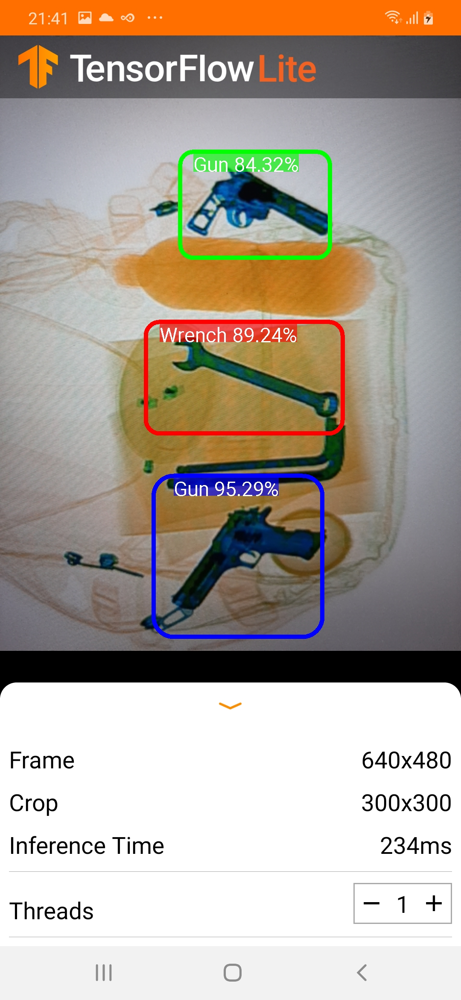

# TensorFlow Lite Object Detection Android

### Overview
This is a camera app that continuously detects the objects (bounding boxes and classes) in the frames seen by your device's back camera, using a quantized [MobileNet SSD](https://github.com/tensorflow/models/tree/master/research/object_detection) model trained on the [COCO dataset](http://cocodataset.org/). These instructions walk you through building and running the project on an Android device.

The model files are downloaded via Gradle scripts when you build and run. You don't need to do any steps to download TFLite models into the project explicitly.

Application can run either on device or emulator ( the emulator must have a connected camera )

## Build the demo using Android Studio

### Prerequisites

* If you don't have already, install **[Android Studio](https://developer.android.com/studio/index.html)**, following the instructions on the website.

* You need an Android device and Android development environment with minimum API 21.
* Android Studio 3.2 or later.

### Building

* Clone or download this repo supported by tensorflow [Tensorflow Examples](https://github.com/tensorflow/examples)

* Open Android Studio, and from the Welcome screen, select Open an existing Android Studio project.

* From the Open File or Project window that appears, navigate to and select the tensorflow-lite/examples/object_detection/android directory ( from the downloaded repo ) , Click OK.

* If it asks you to do a Gradle Sync, click OK.

* Also, you need to have an Android device plugged in with developer options enabled at this point.

### First you need to export the SSD_Model to tflite frozen graph

* The model must be SSD model to be converted to tflite

* We go to object detection directory 
```
cd C:\tensorflow\models\research\object_detection
```

* We export the SSD_Model to tflite frozen graph by running this command
```
python export_tflite_ssd_graph.py --pipeline_config_path=training/ssd_mobilenet_v1_pets.config --trained_checkpoint_prefix training/model.ckpt-XXXX --output_directory inference_graph_for_android --add_postprocessing_op True --max_detections 10
```
where "XXXX" in "model.ckpt-XXXX" should be replaced with the highest-numbered .ckpt file in the training folder.

### Next we’ll Convert the frozen graph to the TFLite model 

* Do that via running [Convert the frozen graph to the TFLite model.ipynb](https://github.com/mennaAyman/Detecting_Forbidden_Items/blob/master/Convert%20the%20frozen%20graph%20to%20the%20TFLite%20model.ipynb)

### Next we will make text file named (labelmap.txt)

the file contains the names of our objects 
```
???
Knife
Gun
Wrench
Pliers
Scissors
```

### Now return to our project on anroid studio and do some changes on it.

* copy the detect.tflite and labelmap.txt files under the assets package in the project

<p align="center">
  
</p>

* Since I choosed the inference type to be float then real-numbers arrays will be of type float in the output file. If they were quantized in the input file, then they get dequantized. So I need to set the value of TF_OD_API_IS_QUANTIZED variable to false in the DetectorActivity.java check the snippet:

```
  // Configuration values for the prepackaged SSD model.
	  private static final int TF_OD_API_INPUT_SIZE = 300;
	  private static final boolean TF_OD_API_IS_QUANTIZED = false;
	  private static final String TF_OD_API_MODEL_FILE = "detect.tflite";
	  private static final String TF_OD_API_LABELS_FILE = "file:///android_asset/labelmap.txt";
```

* Also you need to edit the file TFLiteObjectDetectionAPIModel.java to [TFLiteObjectDetectionAPIModel.java](https://github.com/mennaAyman/Detecting_Forbidden_Items/blob/master/TFLiteObjectDetectionAPIModel.java)

* And last but not least got your build.gradle and comment the following line
```
//apply from:'download_model.gradle'
```

* Sync gradle and plug you phone usb and run the app.

<p align="center">
  
</p>
