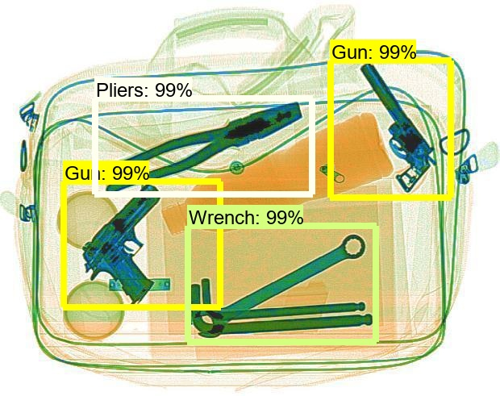
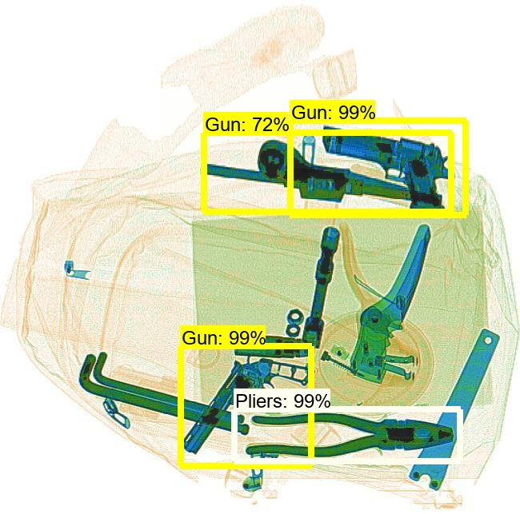
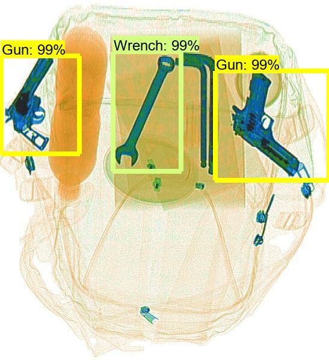
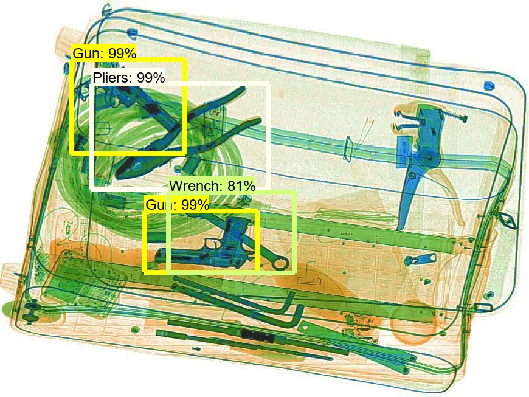
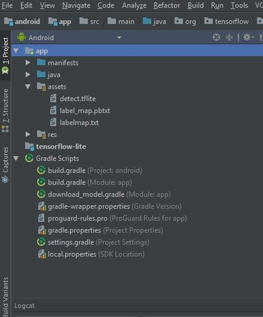

##
# **How To Train an Object Detection Classifier for Multiple Objects Using TensorFlow (GPU)**
##
# Forbidden Items Detection
##
# Brief Summary

This repository aims to use TensorFlow&#39;s Object Detection API to train an object detection classifier for multiple objects on Windows or Linux. It is written using _TensorFlow v1.14_ ( required , because tf v2.x don't have some important functions for this repository )

This readme describes every step required to get going with your own object detection classifier:

1. [Installing Anaconda &quot;optional&quot;, CUDA, and cuDNN]
2. [Setting up the Object Detection directory structure]
3. [Gathering and labeling pictures]
4. [Generating training data]
5. [Creating a label map and configuring training]
6. [Training]
7. [Exporting the inference graph]
8. [Testingthe model]
9. [Evaluating the model]

The repository provides all the files needed to train &quot;detecting forbidden items&quot; . It describes how to replace these files with your own files to train a detection classifier for whatever any other model. It also has Python scripts to test your classifier out on an image or video.

<p align="center">
  
</p>

##
# Introduction

The purpose of this is to explain how to train your own convolutional neural network object detection classifier for multiple objects. At the end, you will have a program that can identify and draw boxes around specific objects in pictures or videos.

We used TensorFlow-GPU v1.14 . TensorFlow-GPU allows your PC to use the video card to provide extra processing power while training. Using TensorFlow-GPU instead of regular TensorFlow reduces training time by a factor of about 8. The CPU-only version of TensorFlow can also be used, but it will take longer. If you use CPU-only TensorFlow, you do not need to install CUDA and cuDNN in Step 1.

##
# Steps

### 1. Install Anaconda &quot;optional&quot;, CUDA, and cuDNN

Install Anaconda (you can use jupyter notebook too), CUDA, and cuDNN.,

Make sure you use the CUDA and cuDNN versions that are compatible with the TensorFlow version you are using.

### 2. Set up TensorFlow Directory

### The TensorFlow Object Detection API requires using the specific directory structure provided in its GitHub repository. It also requires several additional Python packages, specific additions to the PATH and PYTHONPATH variables, and a few extra setup commands to get everything set up to run or train an object detection model.

This portion goes over the full set up required.

2a. Download TensorFlow Object Detection API repository from GitHub

Create a folder directly in C: and name it &quot;tensorflow&quot;. This working directory will contain the full TensorFlow object detection framework, as well as your training images, training data, trained classifier, configuration files, and everything else needed for the object detection classifier.

Download the full TensorFlow object detection repository located at [https://github.com/tensorflow/models](https://github.com/tensorflow/models) by clicking the &quot;Clone or Download&quot; button and downloading the zip file. Open the downloaded zip file and extract the &quot;models-master&quot; folder directly into the C:\tensorflow directory you just created. Rename &quot;models-master&quot; to just &quot;models&quot;.

#### 2b. Download any model you want from TensorFlow&#39;s model zoo

#### (We used Faster-RCNN-Inception-V2-COCO model)

TensorFlow provides several object detection models (pre-trained classifiers with specific neural network architectures) in its [model zoo](https://github.com/tensorflow/models/blob/master/research/object_detection/g3doc/detection_model_zoo.md). Some models (such as the SSD-MobileNet model) have an architecture that allows for faster detection but with less accuracy, while some models (such as the Faster-RCNN model) give slower detection but with more accuracy. I initially started with the ssd\_inception\_V2\_coco model, but it didn&#39;t do a very good job identifying images. I re-trained my detector on the Faster-RCNN-Inception-V2 model, and the detection worked considerably better, but with a noticeably slower speed.

<p align="center">
  
</p>

You can choose which model to train your objection detection classifier on. If you are planning on using the object detector on a device with low computational power, use the SDD-MobileNet model. If you will be running your detector on a decently powered laptop or desktop PC, use one of the Faster RCNN models.

We will use the Faster-RCNN-Inception-V2 model. [Download the model here.](http://download.tensorflow.org/models/object_detection/faster_rcnn_inception_v2_coco_2018_01_28.tar.gz) Open the downloaded faster\_rcnn\_inception\_v2\_coco\_2018\_01\_28.tar.gz file with a file archiver such as WinZip or 7-Zip and extract the faster\_rcnn\_inception\_v2\_coco\_2018\_01\_28 folder to the C:\tensorflow\models\research\object\_detection folder.

#### 2c. Download TFrecords &amp; xml to csv

Download generate\_tfrecord.py from this repo ( [https://github.com/mennaAyman/Detecting\_Forbidden\_Items/tree/master/generate\_tf%20records](https://github.com/mennaAyman/Detecting_Forbidden_Items/tree/master/generate_tf%20records))

Download xml\_to\_csv.py from this repo ([https://github.com/mennaAyman/Detecting\_Forbidden\_Items/tree/master/xml%20to%20csv](https://github.com/mennaAyman/Detecting_Forbidden_Items/tree/master/xml%20to%20csv))

The TFRecord files (train.record and test.record) were generated as described in Step 4. Then run the training.

If you want to train your own object detector, delete the following files (do not delete the folders):

- All files in \object\_detection\images\train and \object\_detection\images\test
- The &quot;test\_labels.csv&quot; and &quot;train\_labels.csv&quot; files in \object\_detection\images
- All files in \object\_detection\training
- All files in \object\_detection\inference\_graph

Now, you are ready to start from scratch in training your own object detector. This tutorial will assume that all the files listed above were deleted, and will go on to explain how to generate the files for your own training dataset.

#### 2d. Install necessary packages
```
C:\> pip install tensorflow==1.14

C:\> pip install pillow

C:\> pip install lxml

C:\> pip install Cython

C:\> pip install contextlib2

C:\> pip install jupyter

C:\> pip install matplotlib

C:\> pip install pandas

C:\> pip install opencv
```

#### 2e. Configure PYTHONPATH environment variable

A PYTHONPATH variable must be created that points to the \models, \models\research, and \models\research\slim directories. Do this by issuing the following commands (from any directory):

```
C:\> set PYTHONPATH=C:\tensorflow\models;C:\tensorflow\models\research;C:\tensorflow\models\research\slim
```

(Note: Every time the &quot;tensorflow&quot; virtual environment is exited, the PYTHONPATH variable is reset and needs to be set up again. You can use &quot;echo %PYTHONPATH% to see if it has been set or not.)

#### 2f. Compile Protobufs and run setup.py

Next, compile the Protobuf files, which are used by TensorFlow to configure model and training parameters. Unfortunately, the short protoc compilation command posted on TensorFlow&#39;s Object Detection API [installation page](https://github.com/tensorflow/models/blob/master/research/object_detection/g3doc/installation.md) does not work on Windows. Every .proto file in the \object\_detection\protos directory must be called out individually by the command.

```
C:\> cd C:\tensorflow\models\research
```

Then copy and paste the following command into the command line and press Enter:

```
protoc --python_out=. .\object_detection\protos\anchor_generator.proto
```

This creates a .py file from every .proto file in the \object\_detection\protos folder.

Finally, run the following commands from the C:\tensorflow\models\research directory:

```
C:\tensorflow\models\research> python setup.py build

C:\tensorflow\models\research> python setup.py install
```

#### 2g. Test TensorFlow setup to verify it works

Run following command to check:

```
python C:/tensorflow/models/research/object_detection/builders/model_builder_test.py
```

### 3. Gather and Label Pictures

Now that the TensorFlow Object Detection API is all set up and ready to go, we need to provide the images it will use to train a new detection classifier.

Download the images dataset from

[https://drive.google.com/drive/folders/1HU99JoeUbyQb\_ox4g7GDzr9ZeHkkhGZU](https://drive.google.com/drive/folders/1HU99JoeUbyQb_ox4g7GDzr9ZeHkkhGZU)

Also download the labels for this dataset (xml files) from

[https://drive.google.com/drive/folders/1ErxbdNhQ-PueagYhxzzLT9YjNo82Tkqx](https://drive.google.com/drive/folders/1ErxbdNhQ-PueagYhxzzLT9YjNo82Tkqx)

Make a new folder in C:\tensorflow\models\research\object\_detection and name it images. then in images divide it into a test and train folders ( take each image with it&#39;s xml file ) .. We used a 90-10 split

### 4. Generate Training Data

<p align="center">
  
</p>

With the images labeled, it&#39;s time to generate the TFRecords that serve as input data to the TensorFlow training model. We will use the xml\_to\_csv.py and generate\_tfrecord.py scripts from [Dat Tran&#39;s Raccoon Detector dataset](https://github.com/datitran/raccoon_dataset), with some slight modifications to work with our directory structure.

First, the image .xml data will be used to create .csv files containing all the data for the train and test images. From the \object\_detection folder, run this command :

```
C:\tensorflow\models\research\object_detection> python xml_to_csv.py
```

This creates a train\_labels.csv and test\_labels.csv file in the \object\_detection\images folder.

Next, open the generate\_tfrecord.py file in a text editor. We replaced the label map starting at line 31 with our label map, where each object is assigned an ID number. This same number assignment will be used when configuring the labelmap.pbtxt file

We replaced the classes the following code in generate\_tfrecord.py:

&quot; You give each class a unique return value&quot;

```
def class_text_to_int(row_label):
    if row_label == 'Knife':
        return 1
    elif row_label == 'Gun':
        return 2
    elif row_label == 'Wrench':
        return 3
    elif row_label == 'Pliers':
        return 4
    elif row_label == 'Scissors':
        return 5
    else:
        return None
```

Then, generate the TFRecord files by issuing these commands from the \object\_detection folder:

```
python generate_tfrecord.py --csv_input=images\train_labels.csv --image_dir=images\train --output_path=train.record
```
```
python generate_tfrecord.py --csv_input=images\test_labels.csv --image_dir=images\test --output_path=test.record
```

These generate a train.record and a test.record file in \object\_detection. These will be used to train the new object detection classifier.

### 5. Create Label Map and Configure Training

The last thing to do before training is to create a label map and edit the training configuration file.

#### 5a. Label map

The label map tells the trainer what each object is by defining a mapping of class names to class ID numbers. Use a text editor to create a new file and save it as labelmap.pbtxt in the C:\tensorflow\models\research\object\_detection\training folder.:

```
item {
    id: 1
    name: 'Knife'
}
item {
    id: 2
    name: 'Gun'
}
item {
    id: 3
    name: 'Wrench'
}
item {
    id: 4
    name: 'Pliers'
}
item {
    id: 5
    name: 'Scissors'
}
```

#### 5b. Configure training

Finally, the object detection training pipeline must be configured. It defines which model and what parameters will be used for training. This is the last step before running training!

Navigate to C:\tensorflow\models\research\object\_detection\samples\configs and copy the faster\_rcnn\_inception\_v2\_pets.config file into the \object\_detection\training directory. Then, open the file with a text editor. There are several changes to make to the .config file, mainly changing the number of classes and examples, and adding the file paths to the training data.

Make the following changes to the faster\_rcnn\_inception\_v2\_pets.config file:

- Line 9. Change num\_classes to the number of different objects. For us, it would be num\_classes : 5 .
- Line 106. Change fine\_tune\_checkpoint to:
  - fine\_tune\_checkpoint : &quot;C:/tensorflow/models/research/object\_detection/faster\_rcnn\_inception\_v2\_coco\_2018\_01\_28/model.ckpt&quot;
- Lines 123 and 125. In the train\_input\_reader section, change input\_path and label\_map\_path to:
  - input\_path : &quot;C:/tensorflow/models/research/object\_detection/train.record&quot;
  - label\_map\_path: &quot;C:/tensorflow/models/research/object\_detection/training/labelmap.pbtxt&quot;
- Line 130. Change num\_examples to the number of images you have in the \images\test directory. For us 744.
- Lines 135 and 137. In the eval\_input\_reader section, change input\_path and label\_map\_path to:
  - input\_path : &quot;C:/tensorflow/models/research/object\_detection/test.record&quot;
  - label\_map\_path: &quot;C:/tensorflow/models/research/object\_detection/training/labelmap.pbtxt&quot;

Save the file after the changes have been made. That&#39;s it! The training job is all configured and ready to go!

### 6. Run the Training

From the \object\_detection directory, issue the following command to begin training:

```
python train.py --logtostderr --train_dir=training/ --pipeline_config_path=training/faster_rcnn_inception_v2_pets.config
```

If everything has been set up correctly, TensorFlow will initialize the training. The initialization can take some time before the actual training begins. When training begins, it will look like this:

<p align="center">
  
</p>

Each step of training reports the loss. It will start high and get lower and lower as training progresses. The loss numbers will be different if a different model is used.

You can view the progress of the training job by using TensorBoard. To do this, open a new Prompt , change directory to the C:\tensorflow\models\research\object\_detection directory, and issue the following command:

```
C:\tensorflow\models\research\object_detection>tensorboard --logdir=training
```

This will create a webpage on your local machine at YourPCName:6006, which can be viewed through a web browser. The TensorBoard page provides information and graphs that show how the training is progressing. One important graph is the Loss graph, which shows the overall loss of the classifier over time.

<p align="center">
  
</p>

The training routine periodically saves checkpoints about every five minutes. You can terminate the training by pressing Ctrl+C while in the command prompt window. You can terminate training and start it later, and it will restart from the last saved checkpoint. The checkpoint at the highest number of steps will be used to generate the frozen inference graph.

### 7. Export Inference Graph

Now that training is complete, the last step is to generate the frozen inference graph (.pb file). From the \object\_detection folder, issue the following command, where &quot;XXXX&quot; in &quot;model.ckpt-XXXX&quot; should be replaced with the highest-numbered .ckpt file in the training folder , for us 250000

```
python export_inference_graph.py --input_type image_tensor --pipeline_config_path training/faster_rcnn_inception_v2_pets.config --trained_checkpoint_prefix training/model.ckpt-250000 --output_directory inference_graph
```

This creates a frozen\_inference\_graph.pb file in the \object\_detection\inference\_graph folder. The .pb file contains the object detection classifier.

### 8. Test the model

The object detection classifier is all ready to go , and there is two notebooks to test images and videos

sample after testing
<p align="center">
  
</p>

<p align="center">
  
</p>


### 9. Evaluating the model

The final step is to evaluate the trained model saved in training/ directory. We have to use eval.py file and can evaluate using following command:

```
python eval.py --logtostderr --pipeline_config_path=training/faster_rcnn_inception_v2_pets.config --checkpoint_dir=training/ --eval_dir=eval/
```

we will get the mean average precision

average precision (Gun)      = 0.973162

average precision (Knife)    = 0.901536

average precision (Pliers)   = 0.931210

average precision (Scissors) = 0.886818

average precision (Wrench)   = 0.847684

Mean average precision (mAP) = 0.907677

<p align="center">
  
</p>

### Demo testing on video

[Detecting Forbidden Items](https://youtu.be/UehYMk8V4vY)


# TensorFlow Lite Object Detection Android

### Overview
This is a camera app that continuously detects the objects (bounding boxes and classes) in the frames seen by your device's back camera, using a quantized [MobileNet SSD](https://github.com/tensorflow/models/tree/master/research/object_detection) model trained on the [COCO dataset](http://cocodataset.org/). These instructions walk you through building and running the project on an Android device.

The model files are downloaded via Gradle scripts when you build and run. You don't need to do any steps to download TFLite models into the project explicitly.

Application can run either on device or emulator ( the emulator must have a connected camera )

## Build the demo using Android Studio

### Prerequisites

* If you don't have already, install **[Android Studio](https://developer.android.com/studio/index.html)**, following the instructions on the website.

* You need an Android device and Android development environment with minimum API 21.
* Android Studio 3.2 or later.

### Building

* Clone or download this repo supported by tensorflow [Tensorflow Examples](https://github.com/tensorflow/examples)

* Open Android Studio, and from the Welcome screen, select Open an existing Android Studio project.

* From the Open File or Project window that appears, navigate to and select the tensorflow-lite/examples/object_detection/android directory ( from the downloaded repo ) , Click OK.

* If it asks you to do a Gradle Sync, click OK.

* Also, you need to have an Android device plugged in with developer options enabled at this point.

### First you need to export the SSD_Model to tflite frozen graph

* The model must be SSD model to be converted to tflite

* We go to object detection directory 
```
cd C:\tensorflow\models\research\object_detection
```

* We export the SSD_Model to tflite frozen graph by running this command
```
python export_tflite_ssd_graph.py --pipeline_config_path=training/ssd_mobilenet_v1_pets.config --trained_checkpoint_prefix training/model.ckpt-XXXX --output_directory inference_graph_for_android --add_postprocessing_op True --max_detections 10
```
where "XXXX" in "model.ckpt-XXXX" should be replaced with the highest-numbered .ckpt file in the training folder.

### Next we’ll Convert the frozen graph to the TFLite model 

* Do that via running [Convert the frozen graph to the TFLite model.ipynb](https://github.com/mennaAyman/Detecting_Forbidden_Items/blob/master/Convert%20the%20frozen%20graph%20to%20the%20TFLite%20model.ipynb)

### Next we will make text file named (labelmap.txt)

the file contains the names of our objects 
```
???
Knife
Gun
Wrench
Pliers
Scissors
```

### Now return to our project on android studio and do some changes on it.

* copy the detect.tflite and labelmap.txt files under the assets package in the project

<p align="center">
  
</p>

* Since I choosed the inference type to be float then real-numbers arrays will be of type float in the output file. If they were quantized in the input file, then they get dequantized. So I need to set the value of TF_OD_API_IS_QUANTIZED variable to false in the DetectorActivity.java check the snippet:

```
  // Configuration values for the prepackaged SSD model.
	  private static final int TF_OD_API_INPUT_SIZE = 300;
	  private static final boolean TF_OD_API_IS_QUANTIZED = false;
	  private static final String TF_OD_API_MODEL_FILE = "detect.tflite";
	  private static final String TF_OD_API_LABELS_FILE = "file:///android_asset/labelmap.txt";
```

* Also you need to edit the file TFLiteObjectDetectionAPIModel.java to [TFLiteObjectDetectionAPIModel.java](https://github.com/mennaAyman/Detecting_Forbidden_Items/blob/master/TFLiteObjectDetectionAPIModel.java)

* And last but not least got your build.gradle and comment the following line
```
//apply from:'download_model.gradle'
```

* Sync gradle and plug your phone usb and run the app.

<p align="center">
  
</p>
